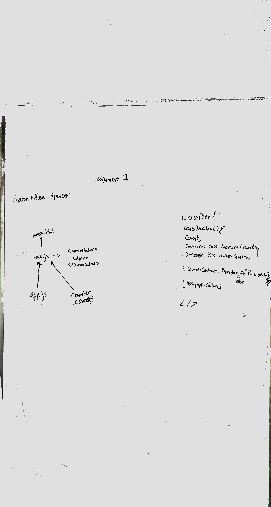
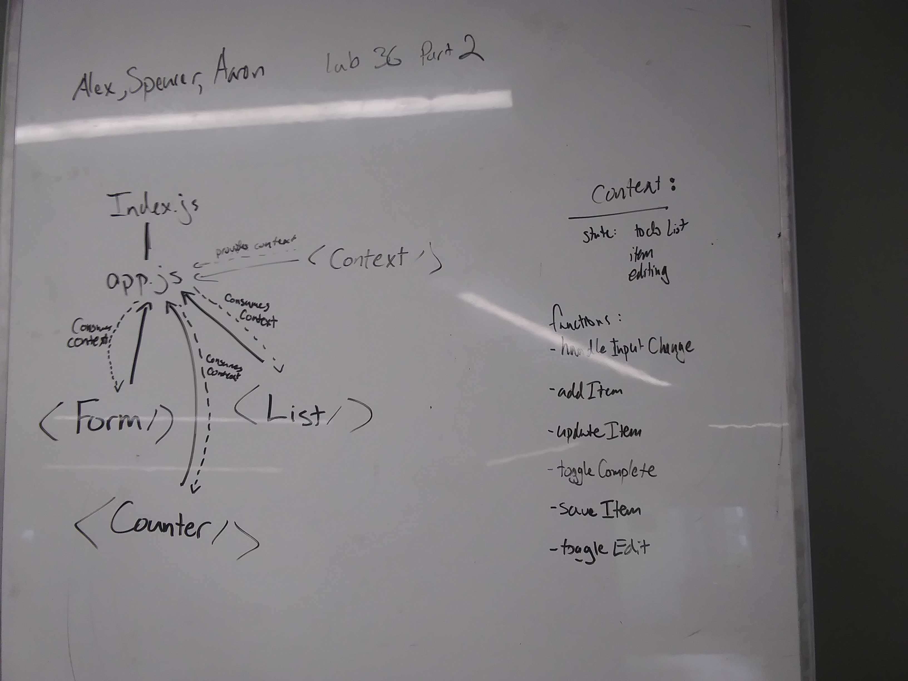

 LAB 36
=================================================

## Context API

### Author: Alexander White

### Links and Resources
* [Repo](https://github.com/alex-white-401-advanced-javascript/lab-36-context-api/)

### Assignment 1
#### Links
* [CodeSandbox](https://codesandbox.io/s/yp83qv708x)

### Modules
#### React Components
##### `index.js`

##### `app.js`

##### `counter-context.js`

##### `counter.js`

##### `incrementer.js`

##### `decrementer.js`

#### UML

### Assignment 2
#### Links
* [CodeSandbox](https://codesandbox.io/s/v61l02x527)

### Modules
#### React Components
##### `index.js`

##### `app.js`

##### `settings-context.js`

##### `counter.js`

##### `form.js`

##### `list.js`

#### UML

